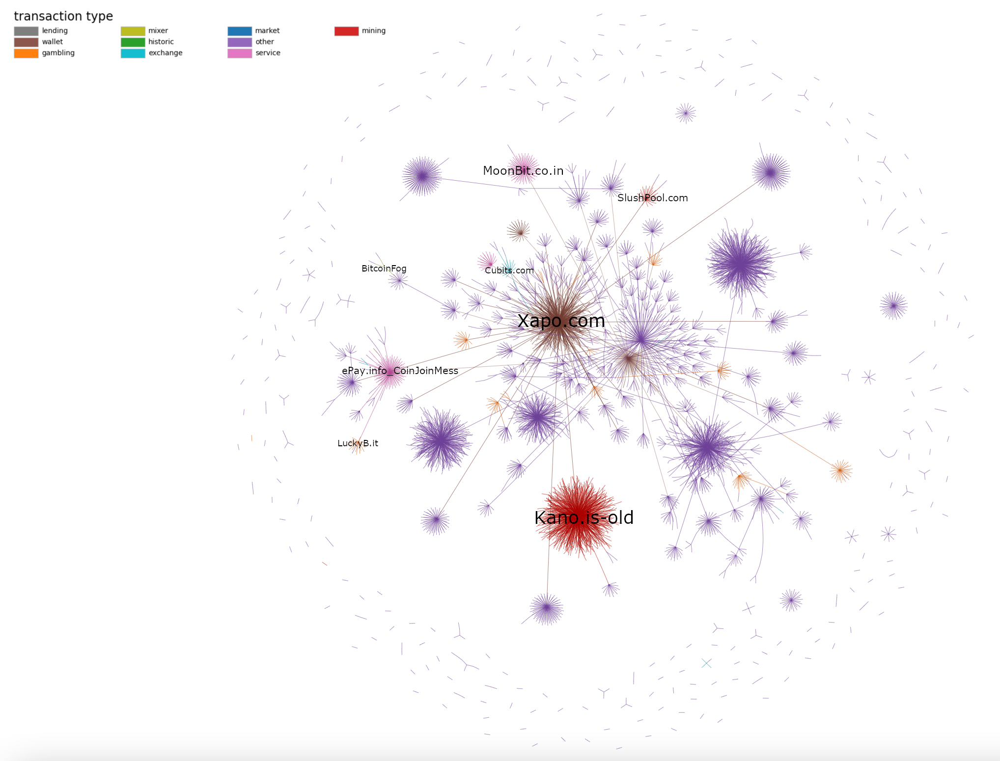

# Hackathon Bitcoin Juin 2022

Etude réalisée lors de la journée Hackathon du 27 Juin 2022 organisée à l'UCBL sur le thème de la cryptomonnaie et Bitcoin. 

Détails http://alter-crypto.sci-web.net/#HACKATHON

Vue interactive ici: https://theodoreguillet.github.io/HackatonBitcoinJuin2022/graph_10000_nodes.html

Le compte rendu est disponible ici: https://theodoreguillet.github.io/HackatonBitcoinJuin2022/Compte_Rendu_Hackathon_Bitcoin.pdf
